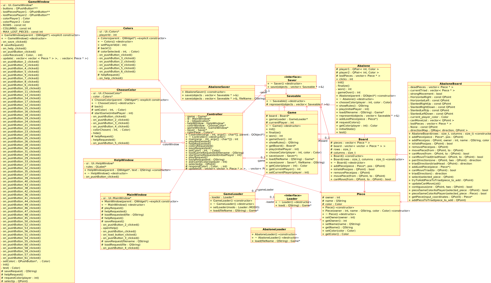

###Universidad de Costa Rica
###Facultad de Ingeniería
###Escuela de Ciencias de la Computación e Informática
###CI 0136 Diseño de Software
###Prof. Alan Calderón
##Segunda entrega del proyecto
###Estudiantes:
* Marcial Carrillo A81379
* Katherine Angulo B70442
* Luis Esteban Ramírez B76144
* Sebastián Cruz B72458

---
###Descripción del proyecto
---
Para la creación del *framework* hemos decidido implementar, dentro de la categoría de **juegos de estrategia**, un juego muy particular y poco conocido, llamado *Abalone*. Este juego consiste de un tablero hexagonal que consiste de 61 huecos circulares, y cada jugador al inicio cuenta con 16 bolas que se encajan en los huecos. El objetivo es expulsar las bolas del contrincante fuera del tablero. El jugador al que le hayan sacado seis bolas del tablero, pierde. Para más información sobre el juego puede visitar la [Wiki de Abalone](https://es.wikipedia.org/wiki/Abalone_(juego_de_mesa)).

---
###Diseño
---

El siguiente diagrama de clases UML generado en *Umbrello* ilustra el diseño del framework en construcción. Se provee el diseño en formato SVG para su mejor apreciación en un visualizador apropiado. La estructura del *framework* está basada en el patrón de diseño Modelo-Vista-Controlador, en donde las clases del Modelo son las que contienen la implementación lógica del juego (Game, Abalone, Board, etc.), el Controlador es explícitamente la clase Controlador que media entre la Vista y el Modelo, y la Vista está conformada por las clases encargadas de la parte gráfica (MainWindow, HelpWindow, GameWindow, etc.).

---
###Implementación
---
Para la implementación de este proyecto, se ha hecho uso del lenguaje C++ para la lógica, junto con el *framework* Qt para la visualización gráfica del juego, la cual se mostrará en los apartados siguientes.

---
###Historias de usuario
---
Las historias de usuario propuestas e implementadas para esta segunda parte del proyecto son:

* Como jugador requiero observar todas mis piezas y las de mi adversario durante todo el
juego para escoger la mejor jugada en cada momento.

* Como jugador requiero se muestre continuamente la piezas que he perdido para valorar
mi posición en el juego.

---
###Implementación de las historias de usuario
---

A continuación, el detalle de la implementación de cada una de las historias de usuario descritas anteriormente, para mostrar que se cumplen:

* Para mostrar todas las piezas de ambos jugadores en el tablero de juego se implementó una interfaz gráfica con el modelo de tablero hexagonal propio de *Abalone*, con 61 botones que representan todas las posiciones que pueden ocupar las fichas durante el juego. Además, se configuró el programa para mostrar el estado inicial del juego, donde cada jugador dispone de 14 fichas del color que haya seleccionado, en la disposición mostrada en la siguiente figura. Para hacer que la interfaz fuera interactiva, y el jugador tuviera retroalimentación constante de lo que está ocurriendo, los botones correspondientes a fichas se colorean de un tono más claro al pasar sobre ellos con el mouse, y se colorean de un tono más oscuro al hacerles click. Los botones que representan campos vacíos (grises) no tienen esas capacidades, para diferenciarlos de los botones que corresponden a fichas.

  
  

* Para mostrar las fichas perdidas de cada jugador en la interfaz, se reservó el espacio necesario para ese efecto arriba y abajo del tablero hexagonal. En la parte superior, se muestran las fichas perdidas del jugador 1 mientras que en la parte inferior se muestran las fichas perdidas del jugador 2. La siguiente figura muestra una simulación de un estado de juego, donde el jugador 1 ha perdido una ficha y el jugador 2 ha perdido 2 fichas.

  
  

---
###Mejoras a implementaciones de las historias de usuario de la entrega anterior
---

Adicionalmente al trabajo que implica la presente entrega, se han mejorado algunas características de las historias de usuario de la entrega anterior, como la apariencia de la ventana de ayuda, la ventana principal, la ventana de selección de colores y la opción de guardar el juego con el nombre y directorio que indique el usuario; mejoras que se muestran en los puntos siguientes:

* Ventana principal: se agregó un tema de *Abalone* como fondo de la ventana, así como se modificó la disposición de los botones.

  
  

* Ventana de selección de color: similar al punto anterior, en esta ventana también se agregó un pequeño fondo con un tema similar.

  
  

* Ventana de ayuda: a diferencia de la entrega anterior, ahora la ventana muestra la información alineada al centro, y también contiene una pequeña imagen con la forma del tablero de juego.

  
  

* Guardado de la partida de juego: a diferencia de la entrega anterior, ahora al seleccionar el botón de guardar se permite que el usuario decida dónde guardar la partida, y el nombre que desea dar al archivo .aba.

  
  

###Especificaciones especiales
---
Si bien es cierto que Qt es un *framework* multiplataforma, no sucede lo mismo con las aplicaciones creadas sobre él, por lo que nuestro proyecto se limitó a correr en ambientes **Windows**.

---
###Manual de usuario
---
Para ejecutar el programa, siga los siguientes pasos:

1. Abra el archivo **diseno.pro** con una versión reciente del IDE Qt (5 o superior).
2. Configure el compilador con la opción de MinGW 32.
3. Haga click en Run, o presione las teclas ctrl+R.
4. Espere a que el programa termine de construirse y desplácese por las ventanas por medio de los botones proporcionados una vez que se muestre la interfaz gráfica.
