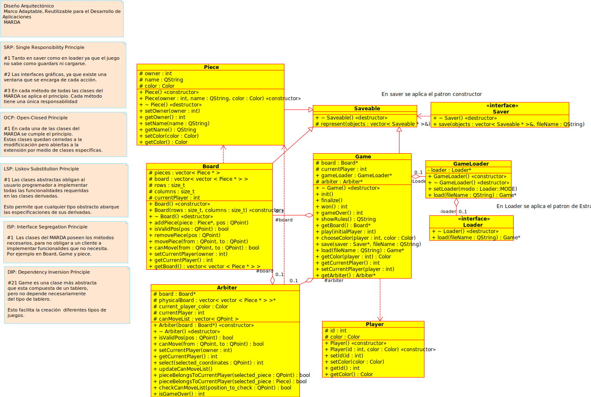

###Universidad de Costa Rica
###Facultad de Ingeniería
###Escuela de Ciencias de la Computación e Informática
###CI0136 Diseño de Software
###Prof. Alan Calderón

###Decisiones de diseño del MaRDA

###Estudiantes:
* Marcial Carrillo Vega A81379
* Katherine Angulo Mendoza B70442
* Sebastián Cruz Chavarría B72458
* Luis Esteban Ramírez B76144

---
###Modelo de clases
---

El modelo de clases se compone de: 

* Game
* GameLoader
* Saveable
* Saver
* Loader
* Player
* Board
* Arbiter

La extensibilidad del código, es decir, la utilidad del framework consiste en el uso de la herencia hacia abajo en la jerarquía de clases, de manera tal que la clase principal de un juego deberá heredar, y por tanto implementar los métodos virtuales, de la clase abstracta Game, así como también deberá crear clases concretas que hereden de Board, Arbiter, Saver, Game, Loader, y opcionalmente de Player. El modelo de clases se muestra en la figura siguiente.

---
###Decisiones de diseño
---

####Tablero como matriz de piezas
Una de las decisiones de diseño más importantes fue implementar el tablero como una *matriz de piezas*, ya que en los casos donde se utilizan tablero con forma no tradicional, como por ejemplo *Abalone*, es más sencillo invalidar ciertas posiciones para dar la forma requerida al tablero, es decir, se cuenta con una matriz cuadrada que contiene ciertas celdas inválidas (en caso que el juego lo requiera) para dar la forma necesaria al tablero emulado.

    

####Lenguaje de programación
Se tomó la decisión de implementar el MaRDA en C++ en conjunto con el framework Qt, debido a la facilidad que éste proporciona para crear ventanas gráficas y manejarlas.  También se consideró esta tupla por la experiencia con la que contaba el equipo en desarrollo de programas en este ambiente de programación.

####La pieza no sabe dónde se encuentra
Se decidió que las piezas o fichas fueran simples objetos que almacenaran como atributos un color, jugador al que pertenece y un nombre para eventual utilidad en procesos de *debugging*, pero la ficha misma no sabe en qué posición del tablero está, sino que es el tablero o Board que conoce las posiciones de las fichas que contiene. Es decir, el "big picture" lo tiene el tablero, no la ficha propiamente.

####Árbitro o juez que verifique todos los movimientos realizados en el juego
Para mantener el orden en cuanto a la estructura de clases, y favorecer al cumplimiento de principios de diseño como el *Single Responsibility* se optó por la creación de una clase Árbitro que regulara los movimientos realizados sobre el tablero, cuya validez o invalidez determinará con las propias reglas del juego que se implemente.

####Patrón Constructor en Guardador
Al enfrentarnos al problema de poder guardar diferentes tipos de juego decidimos implementar este patrón para que cada juego pudiera representarse como un objeto guardable y que de esa manera se puedan crear guardadores en formatos específicos para cada juego que se implemente.

####Patrón Estrategia en Cargador
Análogamente al Guardador, se utiliza el patrón Estrategia para utilizar distintas estrategias para cargar un juego, dependiendo de los formatos especificados con los constructores de juego en el Guardador.

####Visualización y funcionamiento general con MVC
Para cumplir el principio de Single-Responsibility. Con la aplicación de este patrón en el caso particular del desarrollo de *Abalone* aislamos la interfaz gráfica del modelo del juego, permitiendo así gran nivel de *responsiveness* en la aplicación, así como más orden a nivel de programación y métodos más pequeños y sencillos.

